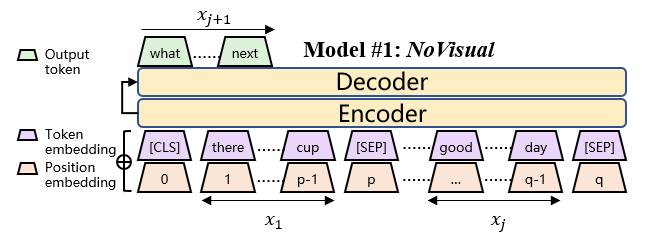
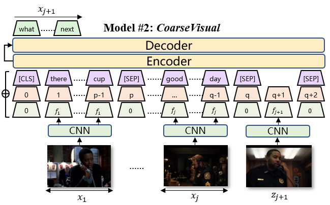
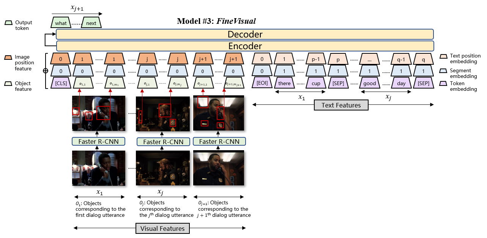
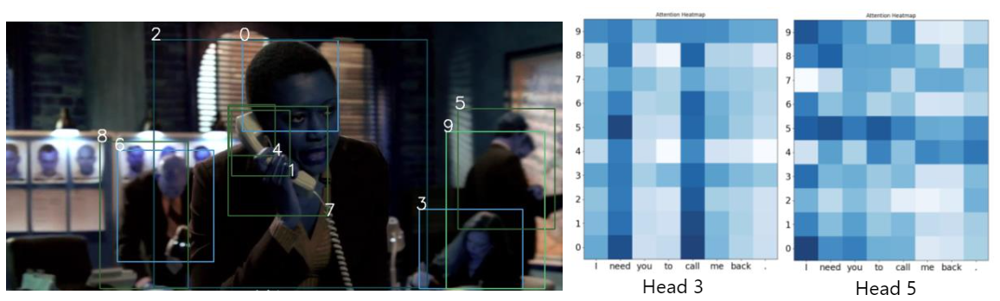

# OpenViDial
This repo contains introduction and downloading instructions of **OpenViDial** dataset.

It also contains codes to reproduce three baselines. (See Section [Baselines](#baselines))

## Dataset

### Introduction
When humans converse, what a speaker will
say next significantly depends on what he sees.
Unfortunately, existing dialogue models generate
dialogue utterances only based on preceding
textual contexts, and visual contexts
are rarely considered. This is due to a lack
of a large-scale multi-module dialogue dataset
with utterances paired with visual contexts.
In this paper, we release OpenViDial, a largescale
multi-module dialogue dataset. The dialogue
turns and visual contexts are extracted
from movies and TV series, where each dialogue
turn is paired with the corresponding
visual context in which it takes place. OpenViDial contains a total number of 1.1 million
dialogue turns, and thus 1.1 million visual contexts
stored in images.


### Download Data
origin data directory structure is shown below (**Note: every `train*` file or directory should have a 'valid' and a 'test' counterpart, we ignore them below for simplicity.**)
```
├──origin_dir
      └── train.origin.txt // each line has a raw sentence. This file has `num_sents` lines
      └── train.dialogue.jsonl // each line is an episode of dialogue, which contains a list of sentence-id, sentence-id should range from 0 to `num_sents-1`
      └── train_images // train images directory, contains `num_sents` images.
            └── 0.jpg
            └── 1.jpg
            └── ...
```
If you'd like to have a glance of real data while do not like to download large datasets, we provide a data sample [here](https://drive.google.com/drive/folders/17XjJ612wMolkrU-ESW5yv6MnbaclrzoM?usp=sharing)

You can download full dataset in following steps:
1. Download `cat.sh`,`train/valid/test.dialogue.jsonl`,`train/valid/test.origin.txt` from the link : `https://drive.google.com/drive/folders/17TTRWbBC0eCNvUz3MLH7eb8fAndjmUA0?usp=sharing` and move them to origin_dir
1. Download `test_images` from the link : `https://drive.google.com/drive/folders/1yffDmbe2JFxKC0YHNyfRG2SeluO5Cp7v?usp=sharing` and move them to origin_dir
1. Download `valid_images` from the link : `https://drive.google.com/drive/folders/1ntNlveebdJDE_nIXmnR-APUAdJ-tlo2Y?usp=sharing` and move them to origin_dir
1. Download `zip_train` from the link : `https://drive.google.com/drive/folders/1Aygv6rTWtvDv7-WLzzOSltHnht_dK80g?usp=sharing` and Run `cat.sh` which you download in the step 1, then move them to origin_dir


## Baselines
We proposed three baselines for this dataset:
* Model #1 - NoVisual: use only dialog texts without visual information

<div align="center">
  
</div>

* Model #2 - CoarseVisual: use texts and a pretrained ResNet50 on ImageNet to compute 1024-d feature from each picture

<div align="center">
  
</div>

* Model #3 - FineVisual: use texts and a pretrained Faster R-CNN on Genome to compute 2048-d * K objects features from each picture

<div align="center">
  
</div>

Faster R-CNN is an object detection framework. The detection sample and attention over objects during text decoding is shown below.

<div align="center">
  
</div>

### Requirements
* python >= 3.6
* `pip install -r requirements.txt`

### Preprocess directory structure
preprocessed_data_dir is a directory that contains all the preprocessed files (text, image feature mmap, offsets, etc.)
generated from [origin_data_dir](#download-data) and we use them in training models. 
The directory structure is shown below.

**Note: every `train*` file or directory should have a 'valid' and a 'test' counterpart, we ignore them below for simplicity.**
```
├──preprocessed_data_dir
      └── train.features.mmap  // numpy mmap array file of shape [num_sents, 1000], each row is a 1024-d ResNet-50 feature
      └── train.objects.mmap  // numpy mmap array file of shape [num_sents, 20, 2048],  faster-rcnn object feature file, each row contain 20 objects feature, which is 2048-d
      └── train.objects_mask.mmap  // numpy mmap array file of shape [num_sents, 20],  faster-rcnn mask file, each row contain 20 objects mask, 1 for valid, 0 for mask
      └── train.offsets.npy  // numpy array file of shape [num_episodes], each item is the offsets of one episode
      └── train.sent_num.npy // numpy array file of shape [num_episodes], each item is the sentence number of one episode
```

### Preprocess text data
We use Moses Tokenizer to tokenize texts and generate offsets arrays:
`bash ./scripts/preprocess_video_data.sh`
and followed with byte-pair-encoding and fairseq-preprocess binarization:
`bash ./scripts/preprocess_text_data.sh`

**Note: You need to change `DATA_DIR, ORIGIN_DIR, OUTPUT_DIR` to your own path**

### Prepare pre-computed CNN features and Faster-RCNN features

##### Download CNN-pooling features(Used for Model #2 - CoarseVisual)
You can download the preprocessed ResNet50 features (`*.features.mmap`) 
from [here](https://drive.google.com/drive/folders/1ixH93LrlVtbKN81VCrSDK_9Y1FH4CiTD?usp=sharing)
and move them under `preprocessed_data_dir/`

##### Download Faster R-CNN features(Used for Model #3 - FineVisual)
You can download the preprocessed Faster R-CNN objects features (`*objects.mmap` and `*objects_mask.mmap`) 
from [here](https://drive.google.com/drive/folders/1_pCmwXcUZv35E9p3sqPeQcdKgGHVZEr7?usp=sharing)
then move them under `preprocessed_data_dir/`

Since file `train.objects.mmap` is too large(100G+), 
we have splitted it to many small pieces like `train.objects.mmap.split*`, 
and you need another step to merge all those files together: `cat * train.objects.mmap.split* >train.objects.mmap`

##### (Optional) Extract features on your own
If you want to extract some feature on your own, or you'd like to know details of extracting visual features, 
see [video_dialogue_model/extract_features/extract_features.md](video_dialogue_model/extract_features/extract_features.md)

### Train and Evaluate Model #1 - NoVisual
`bash scripts/reproduce_baselines/text_only.sh` will train and evaluate model automatically, 
but you should correspondingly change `MODEL_DIR` and `DATA_DIR` for your setup

### Train and Evaluate Model #2 - CoarseVisual
`bash scripts/reproduce_baselines/text_and_img_feature.sh` will train and evaluate model automatically, 
but you should correspondingly change `MODEL_DIR` and `DATA_DIR` for your setup

### Train and Evaluate Model #3 - FineVisual
`bash scripts/reproduce_baselines/text_and_img_objects.sh` will train and evaluate model automatically, 
but you should correspondingly change `MODEL_DIR` and `DATA_DIR` for your setup

### Other Statistics
* get length/diversity/stopwords% statistics of system output: `stats.py`

### Model benchmark
| Model | BLEU-1 | BLEU-2 | BLEU-4 | Stopword% | Dis-1 | Dis-2 | Dis-3 | Dis-4 |
| - | - | - | - | - | - | - | - | - |
| 1-NV | 14.01 | 3.98 | 1.07 | 58.1% | 0.0091 | 0.0355 | 0.0682 | 0.1018 |
| 2-CV | 14.58 | 4.35 | 1.14 | 54.2% | 0.0108 | 0.0448 | 0.0915 | 0.1465 |
| 3-FV | 15.61 | 4.71 | 1.22 | 52.9% | 0.0118 | 0.0502 | 0.1082 | 0.1778 |
