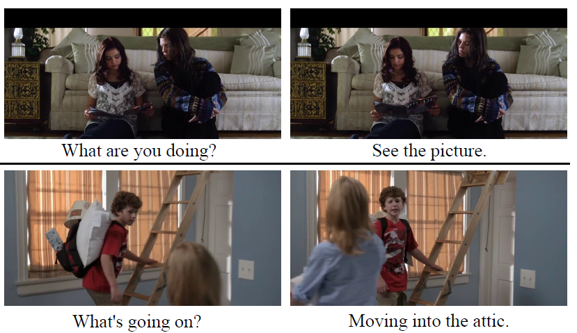

# OpenViDial
This repo contains downloading instructions for the **OpenViDial** dataset 
in [《OpenViDial: A Large-Scale, Open-Domain Dialogue Dataset  with Visual Contexts》](https://arxiv.org/pdf/2012.15015.pdf) along with the code to reproduce results in the paper  (See Section [Baselines](#baselines)). 

## Introduction
When humans converse, what a speaker will
say next significantly depends on what he sees. OpenViDial is a largescale
multi-module dialogue dataset for this purpose. The dialogue
turns and visual contexts are extracted
from movies and TV series, where each dialogue
turn is paired with the corresponding
visual context in which it takes place. OpenViDial contains a total number of 1.1 million
dialogue turns, and thus 1.1 million visual contexts
stored in images.

The following are  two short conversations where visual contexts are crucial.

<div align="center">
  
</div>

### Detailed statistics for OpenViDial
| Attribute | value |
| - | - |
|Number of turns| 1.1M|
|Number of images |1.1M|
|Vocab size before BPE | 70K |
|Vocab size after BPE | 30K |
|Average length of each episode |14|
|Average length of each turn|7.6 |


## Download the Dataset

**\*\*\*\*\* New March 12th, 2021: New cnn/rcnn feature on test/valid dataset \*\*\*\*\***

We fixed the bug of cnn/rcnn features on valid/test dataset and re-run the experiments on the new data.
Evaluation metrics are also updated.

The main folder `origin_dir` contains training/valid/test sets, each of which is made up by the following files:
```
├──origin_dir
      └── train.dialogue.jsonl // each line is an episode of dialogue, which a list of IDs.    
      └── train.origin.txt // each line corresponds to a dialogue text utterence, with the ID being its line number (staring with 0).
      └── train_images // containing images (visual contexts) in which the text utterence take place, with ID being the image filename (0,1,2, etc)
            └── 0.jpg
            └── 1.jpg
            └── ...
      └── valid.* (i.e., valid.dialogue.jsonl, valid.origin.txt, valid_images)
      └── test.*  (i.e., test.dialogue.jsonl, test.origin.txt, test_images)
```

If you'd like to take a glance at the a sample of the dataset instead of downloading the full dataset, we provide a data sample [here](https://drive.google.com/drive/folders/17XjJ612wMolkrU-ESW5yv6MnbaclrzoM?usp=sharing)

Data download:
1. Download `[train|valid|test].origin.txt` and `[train|valid|test].dialogue.jsonl` [here](https://drive.google.com/drive/folders/15qznjUWaIJ-TzT4YTdcgR9-fMumOfjFx?usp=sharing) 
2. Download `test_images` (~ 20G)  [here](https://drive.google.com/file/d/1DgZXlGi_x37nQrJYK4tSLXEvVShBKaZY/view?usp=sharing) 
3. Download `valid_images` (~ 20G) [here](https://drive.google.com/file/d/1J6YMq3Zwqdhi93IZFHi1JoS9xvcZcPfM/view?usp=sharing) 
4. Download train_images: Since train_images is too big (~ 170G), we split it to 12 zip files.  Download seperate files `zip_train`  [here](https://drive.google.com/drive/folders/1Aygv6rTWtvDv7-WLzzOSltHnht_dK80g?usp=sharing). Then download and run `cat.sh` [here](https://drive.google.com/file/d/1GUBBAdm8-1O3a5ZJ5JmkwSBFiFoEp09k/view?usp=sharing) to include all files in the same directory.  
5. Move all files to `origin_dir`. 


## Models
We proposed three models for this dataset. Please refer to the paper for details:
* **Model #1 - NoVisual**: use only dialog texts without visual information

<div align="center">
  
</div>

* **Model #2 - CoarseVisual**: use texts and a pretrained ResNet50 on ImageNet to compute 1000-d feature from each picture

<div align="center">
  
</div>

* **Model #3 - FineVisual**: use texts and a pretrained Faster R-CNN on Genome to compute 2048-d * K objects features from each picture

<div align="center">
  
</div>

Faster R-CNN is an object detection framework. The detection sample and attention over objects during text decoding is shown below.

<div align="center">
  
</div>

### Requirements
* python >= 3.6
* `pip install -r requirements.txt`

### Preprocess directory structure
preprocessed_data_dir is a directory that contains all the preprocessed files (text, image feature mmap, offsets, etc.)
generated from [origin_data_dir](#download-data) and we use them in training models. 
The directory structure is shown below.

**Note: every `train*` file or directory should have a 'valid' and a 'test' counterpart, we ignore them below for simplicity.**
```
├──preprocessed_data_dir
      └── train.features.mmap  // numpy mmap array file of shape [num_sents, 1000], each row is a 1000-d ResNet-50 feature
      └── train.objects.mmap  // numpy mmap array file of shape [num_sents, 20, 2048],  faster-rcnn object feature file, each row contain 20 objects feature, which is 2048-d
      └── train.objects_mask.mmap  // numpy mmap array file of shape [num_sents, 20],  faster-rcnn mask file, each row contain 20 objects mask, 1 for valid, 0 for mask
      └── train.offsets.npy  // numpy array file of shape [num_episodes], each item is the offsets of one episode
      └── train.sent_num.npy // numpy array file of shape [num_episodes], each item is the sentence number of one episode
```

### Preprocess text data
We use Moses Tokenizer to tokenize texts and generate offsets arrays:
`bash ./scripts/preprocess_video_data.sh`
and followed with byte-pair-encoding and fairseq-preprocess binarization:
`bash ./scripts/preprocess_text_data.sh`

**Note: You need to change `DATA_DIR, ORIGIN_DIR, OUTPUT_DIR` to your own path**

### Prepare pre-computed CNN features and Faster-RCNN features

##### Download CNN-pooling features(Used for Model #2 - CoarseVisual)
Preprocessed ResNet50 features (`*.features.mmap`) 
[(~4G) can be downloaded from here](https://drive.google.com/drive/folders/1wHY-hQqMHqXaqLLBar7HFGvjTPVOCECc?usp=sharing)
and move them under `preprocessed_data_dir/`

##### Download Faster R-CNN features(Used for Model #3 - FineVisual)
Preprocessed Faster R-CNN objects features (`*objects.mmap`, `*objects_mask.mmap`) 
[(~160G) can be downloaded from here](https://drive.google.com/drive/folders/1p49gHmlQ-3X2hsX18gr7aoqFsJCwcMNt?usp=sharing)
then move them under `preprocessed_data_dir/`

Since file `train.objects.mmap` is too large(100G+), 
we splitted it to many small pieces like `train.objects.mmap.split*`, 
and you need another step to merge all those files together: `cat train.objects.mmap.split* >train.objects.mmap`

##### (Optional) Extract features on your own
If you want to extract some feature on your own, or you'd like to know details of extracting visual features, 
see [video_dialogue_model/extract_features/extract_features.md](video_dialogue_model/extract_features/extract_features.md)

### Train and Evaluate Model #1 - NoVisual
`bash scripts/reproduce_baselines/text_only.sh` will train and evaluate NoVisual, 
Remember to change `MODEL_DIR` and `DATA_DIR` for your setup. 
**Note:** `fairseq` may use all gpus on your machine and the actual batch size is times by number of gpus.
Therefore, if you use multiple gpus, batch size should be devided by number of gpus.

### Train and Evaluate Model #2 - CoarseVisual
`bash scripts/reproduce_baselines/text_and_img_feature.sh` will train and evaluate CoarseVisual.
Remember to change `MODEL_DIR` and `DATA_DIR` for your setup. Please make sure you use one single gpu to reproduce our results.

### Train and Evaluate Model #3 - FineVisual
`bash scripts/reproduce_baselines/text_and_img_objects.sh` will train and evaluate FineVisual, 
Remember to change `MODEL_DIR` and `DATA_DIR` for your setup. Please make sure you use one single gpu to reproduce our results.

### Other Statistics
* get length/diversity/stopwords% statistics of system output: `train/stats.py`

### Model benchmark
| Model | BLEU-1 | BLEU-2 | BLEU-4 | Dis-1 | Dis-2 | Dis-3 | Dis-4 |
| - | - | - | - | - | - | - | - |
| 1-NV | 14.06 | 3.80 | 0.95 | 0.0006 | 0.0019 | 0.0314 | 0.0043 |
| 2-CV | 14.70 | 4.38 | 1.14 | 0.0023 | 0.0090 | 0.0177 | 0.0272 |
| 3-FV | 14.85 | 4.61 | 1.19 | 0.0026 | 0.0112 | 0.0246 | 0.0406 |
